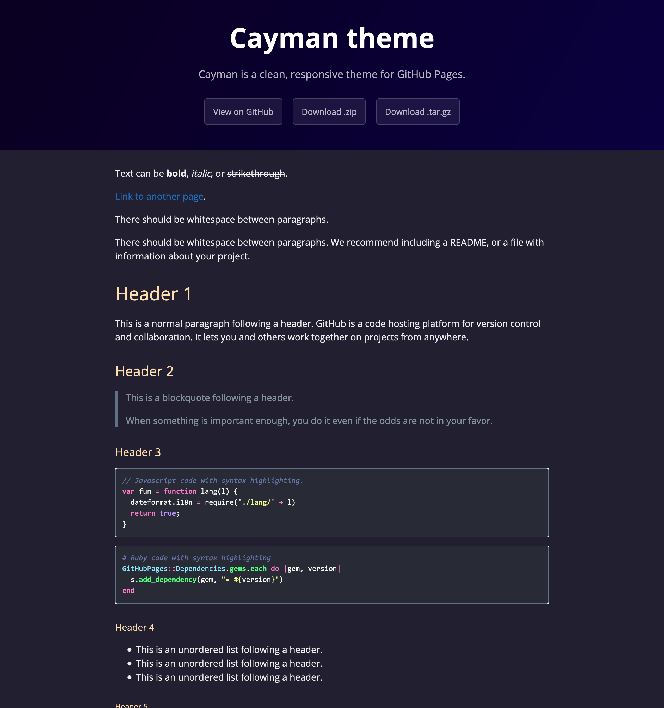

# The Cayman Midnight theme

*Cayman Midnight is the Jekyll theme forked from [Cayman theme](https://github.com/pages-themes/cayman).



## Usage

Just fork this repository: this project doesn't provide Gem.

## Customizing

### Configuration variables

Cayman will respect the following variables, if set in your site's `_config.yml`:

```yml
title: [The title of your site]
description: [A short description of your site's purpose]
```

Additionally, you may choose to set the following optional variables:

```yml
show_downloads: ["true" or "false" to indicate whether to provide a download URL]
google_analytics: [Your Google Analytics tracking ID]
```

### Stylesheet

If you'd like to add your own custom styles:

1. Create a file called `/assets/css/style.scss` in your site
2. Add the following content to the top of the file, exactly as shown:

    ```scss
    ---
    ---

    @import "{{ site.theme }}";
    ```

3. Add any custom CSS (or Sass, including imports) you'd like immediately after the `@import` line

*Note: If you'd like to change the theme's Sass variables, you must set new values before the `@import` line in your stylesheet.*

### Layouts

If you'd like to change the theme's HTML layout:

1. [Copy the original template](https://github.com/yammmt/cayman-midnight/blob/mine/_layouts/default.html) from the theme's repository<br />(*Pro-tip: click "raw" to make copying easier*)
2. Create a file called `/_layouts/default.html` in your site
3. Paste the default layout content copied in the first step
4. Customize the layout as you'd like

### Overriding GitHub-generated URLs

Templates often rely on URLs supplied by GitHub such as links to your repository or links to download your project. If you'd like to override one or more default URLs:

1. Look at [the template source](https://github.com/yammmt/cayman-midnight/blob/mine/_layouts/default.html) to determine the name of the variable. It will be in the form of `{{ site.github.zip_url }}`.
2. Specify the URL that you'd like the template to use in your site's `_config.yml`. For example, if the variable was `site.github.url`, you'd add the following:

    ```yml
    github:
      zip_url: http://example.com/download.zip
      another_url: another value
    ```

3. When your site is built, Jekyll will use the URL you specified, rather than the default one provided by GitHub.

*Note: You must remove the `site.` prefix, and each variable name (after the `github.`) should be indent with two space below `github:`.*

For more information, see [the Jekyll variables documentation](https://jekyllrb.com/docs/variables/).

## Contributing

It's better for you to contribute to the [original Cayman project](https://github.com/pages-themes/cayman).

If you're interested in *this* project, creating issues is the easy way.

### Previewing the theme locally

If you'd like to preview the theme locally (for example, in the process of proposing a change):

1. Clone down the theme's repository (`git clone https://github.com/yammmt/cayman-midnight`)
2. `cd` into the theme's directory
3. Run `script/bootstrap` to install the necessary dependencies
4. Run `bundle exec jekyll serve` to start the preview server
5. Visit [`localhost:4000`](http://localhost:4000) in your browser to preview the theme

### Running tests

The theme contains a minimal test suite, to ensure a site with the theme would build successfully. To run the tests, simply run `script/cibuild`. You'll need to run `script/bootstrap` once before the test script will work.

## Thanks

Again, this repository is the fork of [the Cayman repository](https://github.com/pages-themes/cayman).

For syntax highlight theme, this repository uses [the Dracula Theme](https://github.com/dracula/dracula-theme).
